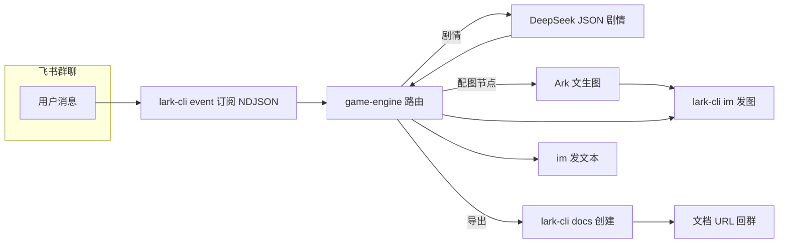

# 蝴蝶效应 —— 群聊互动叙事游戏

## 功能概述

在飞书群聊中运行的多人互动叙事：玩家 @机器人 参与，决策影响走向；引擎用 **DeepSeek** 生成剧情，用 **火山方舟 Ark**（OpenAI 兼容接口）生成概念图；状态按群聊隔离，存于本机。

## 与官方 Lark Skills 的关系

本仓库的 **SKILL.md** 描述的是「蝴蝶效应」这一玩法与引擎行为；运行依赖的 CLI 能力分别对应：

- **lark-shared**：`lark-cli` 配置与登录（`--as bot`）
- **lark-event**：事件长连接思路一致；引擎内直接调用 `lark-cli event +subscribe --compact`
- **lark-im**：发消息与图片（`im +messages-send`）
- **lark-doc**：创建云文档（`docs +create --title … --markdown @file`，v1 API 可明确设置标题）

无需重复安装本仓库 Skill 即可使用同一套 `lark-cli`；本条目用于说明依赖边界与排错时应对照的官方能力。

### 与其它官方 Skill 的「组合叙事」（不写进引擎，仅编排说明）

- 本 Skill **只负责群聊里 @ 机器人后的叙事循环**（`event` → Python → `im` / `docs` / Ark），**不会**自动读日历或会议。
- 若要做「会前暖场 / 故事接龙」：**人**在会前用 **lark-calendar** / **lark-vc** 查时间、发会议提醒后，再在群里 **@ 机器人** 发送 `开始游戏 …` 即可；两条链路独立，避免把日历 scope 强行绑进本仓库。
- 适合写进主持稿：「会议开始前 5 分钟，群内 @ 机器人 `开始游戏 preset:mars`」。

## 数据流（概览）

## 演示路径（建议）

1. 配置 `.env`（至少 `DEEPSEEK_API_KEY`；配图再加 `ARK_API_KEY`）与机器人权限。
2. 项目根执行 `python scripts/game-engine.py`，确认订阅进程无「单应用单订阅」冲突。
3. 群内：`@机器人 帮助` → `开始游戏 preset:mars` 或 `开始游戏 #demo`（键名见 `config.yaml` 的 `presets`）→ 用自然语言推进若干步 → `导出梗概` → `结束游戏` 看全文归档与「累计完成 N 局」。

更固定的 **大赛口令序列** 见 [`references/demo-presets.md`](references/demo-presets.md)。

## 核心机制

### 1. 多人协作叙事

- 群成员均可 @机器人 提交决策（同群共享一局状态）
- 每次决策生成新剧情节点；开局与部分回复会附带 **2～4 个选项** 提示

### 2. 状态与配置

- 存档目录：`~/.butterfly-effect/saves/<chat_id>.json`
- **config.yaml**（项目根目录）由引擎加载：`game` / `llm` / `safety` / **`presets`**（剧本预设）等；需安装 **PyYAML**（见 `requirements.txt`）
- 无 yaml 或解析失败时使用内置默认值
- **预设开局**：`开始游戏 preset:键名` 或 `开始游戏 #键名`，正文为预设中的 `opening`；`帮助` 会列出当前键名
- **累计通关**：每成功执行一次「结束游戏」（从进行中变为结束）`runs_completed` +1，并写入 `last_ended_at`（ISO 时间）；**娱乐向统计**，与「重新开始」清空本局剧情 **无关**（周目数不随重新开始清零）
- **新开局与存档节点**：「结束游戏」后本地仍暂存上一局节点，便于未导出时再发「导出故事」；一旦成功执行 **「开始游戏 / 新游戏」** 并生成第一幕，引擎会 **清空节点再写入新局**，避免下一篇飞书文档把多局剧情拼在一起。若上一局导出失败，请先 **导出故事** 再开新局。
- **配图跳过计数**：本局内每次到达配图节点但未出图（无 `ARK_API_KEY` 或 Ark 失败）累计 `image_skips_this_run`；首次跳过会在群内提示一次含当前 N，之后请用「游戏状态」查看累计；「结束游戏」结算句中也会带本局跳过次数

### 3. 剧情与上下文

- 使用 `config.yaml` 中的 **`context_window_nodes`** 控制传入模型的最近节点数（默认 5）
- 模型输出要求为 JSON：`scene`、`narrative`、`mood`、`choices`

### 4. 概念图

- 每 **`image_gen_interval`** 次 **玩家剧情决策** 尝试生成一张图（默认 3）；**不含**开局幕 `[开始]`，与「总节点数」不是同一计数。
- **仅**在 `handle_decision`（推进剧情）成功后按上述次数判断；「选项 / 导出 / 游戏状态」等 **不会** 新增剧情节点，也 **不会** 因此触发生图。
- 依赖 `.env` 中 **`ARK_API_KEY`**、**`ARK_MODEL`**；未配置或 Ark 失败时 **每种原因首次** 提示一条（含当时累计跳过次数），之后同局不再逐条刷屏，改在 **游戏状态** / **结束游戏** 中体现 `image_skips_this_run`

### 5. 存档导出

- **结束游戏**：标记结束、**通关计数 +1**、创建全文飞书文档
- **导出故事**：不结束对局，导出全文 Markdown 文档
- **导出梗概**：不结束对局；若配置了 `DEEPSEEK_API_KEY` 则先请求模型生成条目化梗概，否则用规则截断生成；计入与「选项」相同的每分钟频率限制
- **本地快照**：`结束游戏` / `导出故事` 会额外写入 `~/.butterfly-effect/finished-runs/*.md`；即使飞书导出失败，也能保留当局 Markdown。

### 6. 防刷与暂停

- **`max_decisions_per_minute`**：每群每分钟 LLM 请求（含剧情决策、「选项」「导出梗概」）上限，超限提示稍后再试
- **`inactivity_timeout`**：超过该秒数无新操作则 **自动暂停**；再次游玩需「开始游戏」或「重新开始」

## 指令路由（避免误触剧情）

- 管理类口令优先按 **行首可选礼貌前缀**（如请/帮）+ **关键词** + **句尾仅标点或谢谢/吧** 匹配；像「导出故事：……」后面跟正文会 **视为剧情** 而非导出。
- 若口令与剧情仍冲突，请把管理指令 **单独发一行**，或使用 `帮助` 中的标准短语。

## 游戏指令速查

以下口令建议 **单独一行** 发送。

| 指令 | 说明 |
| :--- | :--- |
| `@机器人 帮助` / `菜单` / `蝴蝶效应` | 显示指令说明 |
| `@机器人 开始游戏 [开头]` / `新游戏 [开头]` | 开局；可用 `preset:键名` 或 `#键名` 载入 **config.yaml** 预设 |
| `@机器人 [任意描述]` | 推进剧情（局中） |
| `@机器人 游戏状态` | 进行中：幕数、累计通关、参与者与最近剧情；空闲时仍会提示累计通关（若有） |
| `@机器人 选项` / `看选项` / `行动选项` | 仅列 2～4 个行动方向（调用 LLM，计入频率限制） |
| `@机器人 回溯` | 撤销上一幕（至少保留第一幕） |
| `@机器人 重新开始` | 清空本局剧情与参与者；**不**重置累计通关局数 |
| `@机器人 导出故事` | 导出全文飞书文档，**不**结束游戏 |
| `@机器人 导出梗概` | 导出梗概飞书文档（**不**结束；可能调用 LLM） |
| `@机器人 结束游戏` | 结束本局、通关计数 +1、导出全文文档 |

**与代码对齐的说明**：群聊里 @ 机器人 后，引擎会 **去掉开头的 @xxx**，再对剩余正文做路由；上表中的口令 **无需** 把 `@机器人` 打进正则。管理类口令（除「开始游戏」因含可变正文外）均支持 **行首**「请、帮…」及 **句尾**「吧、谢谢」与常见标点，与「结束游戏」一致；**各管理词内部**亦允许 IME 产生字间空格（如「导 出 故 事」「结 束 游 戏」），避免误判为剧情。

## 环境变量（.env）

| 变量 | 用途 |
| :--- | :--- |
| `DEEPSEEK_API_KEY` | 剧情生成（必填） |
| `LLM_API_URL` / `LLM_MODEL` | 可选覆盖默认 DeepSeek 端点与模型 |
| `ARK_API_KEY` / `ARK_MODEL` | 文生图（无 Key 则跳过出图） |
| `FEISHU_BOT_OPEN_ID` | 可选；compact 事件若缺 `sender_type` 时用于忽略机器人自身消息，防回声 |

## 运行方式

1. `pip install -r requirements.txt`
2. 配置 `lark-cli` 机器人身份与权限（`im.message.receive_v1`、发消息、建文档等）
3. 项目根目录：`python scripts/game-engine.py`（Windows 常用 `python`）
4. 引擎会启动：`lark-cli event +subscribe --as bot --compact --event-types im.message.receive_v1`
5. 同一应用仅允许 **一条** 订阅长连接；冲突时关掉旧进程（`Ctrl+C`，**不要** `Stop-Process` 强杀，否则 lark-cli 子进程成孤儿继续占连接）再重启即可
6. 调试模式：`python scripts/game-engine.py --debug`，每条事件及发出的回复均打印日志，便于排查指令路由或消息格式问题

## 安全与合规

- **本地落盘**：每群存档 `~/.butterfly-effect/saves/<chat_id>.json`；临时导出 `项目/.butterfly-effect/export-temp/*.md`；配图缓存 `项目/.butterfly-effect/image-cache/`。不含完整飞书消息日志，仅持久化本玩法所需字段。
- **结束快照**：每次 `结束游戏` / `导出故事` 会保存 `~/.butterfly-effect/finished-runs/*.md`，用于防止飞书导出失败或新开局清空当前节点后丢失上一局内容。
- **出站与密钥**：`DEEPSEEK_API_KEY` → DeepSeek（剧情 JSON）；`ARK_API_KEY` → 火山方舟（图片 URL）；飞书侧经 `lark-cli` 使用已登录身份，**勿**把 Key 贴进群里或写进可提交的 `.env`。
- **消息与隐私**：引擎处理 **当前条** 群文本用于路由与 LLM；**不**把历史聊天记录批量同步到第三方，也不实现「全量消息存档到外部」。
- **内容合规**以模型与飞书/火山侧策略为主；引擎内 **未** 单独实现关键词过滤（`config.yaml` 中 `content_filter` 为占位说明）。

## 故障排查

- **机器人复读上一段剧情**：多为机器人自身消息被当成用户输入；已忽略 `sender_type=app` 并做正文去重；仍异常时请配置 `FEISHU_BOT_OPEN_ID`
- **「新游戏」「开始游戏」等被当成剧情推进**：常见三类原因——① **`@机器人新游戏`（@ 与指令无空格）**，已用指令词在 `@` 后切开；② **「新 游戏」「开 始游戏」** 等 IME 在字间插空格，旧正则要求「新」「游戏」紧邻，会漏匹配并落入剧情，已改为 `新\s*游\s*戏` / `开\s*始\s*游\s*戏`；③ 先误推进了一幕时，下一跳可能配图，出现「一句话 + 一张图」。
- **`--image` 路径错误**：图片缓存在项目下 `.butterfly-effect/image-cache/`，以相对路径发给 `lark-cli`
- **飞书文档标题显示 Untitled**：引擎使用 `docs +create --title … --markdown @file`（v1 API）明确设置标题；若更换了 lark-cli 版本或手动调用 v2 API 且未传 `--title`，会退回 Untitled。请确保使用引擎内置导出函数而非手动命令。
- **Windows 停进程必须用 `Ctrl+C`**：`Stop-Process -Force` 强杀 Python 后 lark-cli 子进程变孤儿，继续占用飞书服务端 WebSocket 连接，导致再启动时报「already running」。孤儿进程可用 `Stop-Process -Name lark-cli -Force` 清理。
- **飞书导出失败但游戏已结束**：引擎会继续结束本局并增加通关数，同时在 `~/.butterfly-effect/finished-runs/` 保留 Markdown 快照；修好 docs 权限后可参考本地文件重新上传。
- **Windows 编码**：订阅子进程 stdout 使用 UTF-8 解码

## 路线图（候选，未承诺排期）

与实现 **不同步** 的设想仅列在此，避免 SKILL 过度承诺：

| 方向 | 说明 |
| :--- | :--- |
| 本局标签进 prompt | 开局 `#风格# 正文` → `state.tags`（与现有 `#预设键` 需语法区分） |
| 极简投票 | `选 2` 绑定上一轮 `choices` + 超时 |
| DM 私聊摘要 | `im` p2p、额外 scope、`DM_TARGET_OPEN_ID` |
| 节点 `inventory` / `flags` | LLM 可选 JSON 字段原样进存档与 prompt |
| 固定周报 doc append | `docs +update` + `.env` 中 doc token |
| **v1.2+ 体验** | 梗概模板可配置、多语言提示词 |
| **运维** | Docker/systemd 示例、结构化日志与指标 |

## 实现边界与可扩展方向（便于迭代 SKILL/代码）

| 项目 | 现状 |
| :--- | :--- |
| 配图计数 | 按 **玩家剧情决策次数**（`decision != "[开始]"`），不是 `len(nodes)`；与 `image_gen_interval` 语义一致 |
| 长期图片归档 | 当前飞书文档仍写入 Ark 临时 URL；长期有效图片归档需后续上传到飞书素材/附件 |
| 角色/NPC 结构化状态 | 未建模，仅靠 LLM 上下文 |
| 富文本/卡片消息 | 仅处理文本 `message_type=text` |
| 用户昵称展示 | 状态里存 open_id，未解析通讯录 |
| 多语言 | 提示词以中文为主 |
| 单元测试 / CI | 无 |
| 与 `references/*.md` | `game-rules.md` 与引擎对齐；`demo-presets.md` 为演示口令序列；`prompt-templates.md` 等非运行时加载 |

## 注意事项

- 引擎需常驻进程接收长连接事件；可用 tmux/screen/服务托管
- 每群同时一局；**重新开始** 会清空本局剧情与参与者，**累计通关局数保留**
- 飞书可能对事件处理有时延；剧情+生图较慢时或出现平台重推
